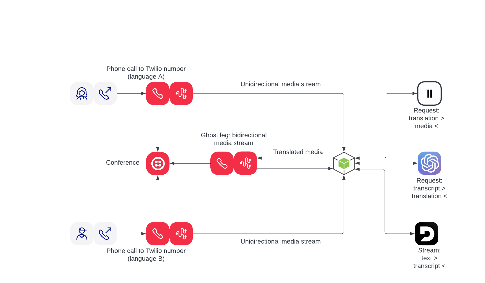

# Generative AI Translator app

This app showcases how one can build an AI powered translator application based on Twilio [Media Streams](https://twilio.com/media-streams).
Media Streams provides a Websocket connection to a phone call.
You can get audio streamed to you, process it, and send audio back.

The project uses following external service:
- [Deepgram](https://deepgram.com/) for Speech to Text
- [elevenlabs](https://elevenlabs.io) for Text to Speech
- [OpenAI](https://openai.com) for GPT translation

## Application diagram


## Step-by-step explanation
1. When the call arrives to the number "A" an instruction will be fetched from `/incoming-a` endpoint.
1. Following the instruction:
   - unidirectional media stream will be started using TwiML [Stream](https://www.twilio.com/docs/voice/twiml/stream) noun towards `/connection-a` endpoint.
   - once the stream is open the caller will be added to a new conference. The caller will hear hold music. At this point it time the conference is not started yet.
1. When the call arrives to the number "B" an instruction will be fetched from `/incoming-b` endpoint.
1. Following the instruction:
    - unidirectional media stream will be started using TwiML [Stream](https://www.twilio.com/docs/voice/twiml/stream) noun towards `/connection-b` endpoint.
    - once the stream is open the caller will be added to a new conference. At this point the conference is started.
1. Since the conference is now started a webhook will be fired to the `/conference-status` endpoint with a `conference-start` event.
This will trigger adding so-called "ghost leg" participant to the conference. Ghost leg is used to return translated media back to the conference.
1. Following the instruction:
    - a new participant will be created in the conference, in simple words we will be making an outbound call from a Twilio number (GHOST_LEG_FROM_NUMBER in .env) to another Twilio number (GHOST_LEG_TO_NUMBER in .env)
    - instruction will be fetched using `/incoming-ghost` endpoint
    - following the instruction a bidirectional stream will be open towards `/connection-ghost` endpoint
1. From now on if participant A (B) says something it will be:
    - streamed to our backend where it will be transcribed using Deepgram
    - translated to language B (A) using Chat GPT
    - from the translated text Elevenlabs will generate speech
    - the speech will be sent back to the conference using "ghost leg"

Note: both participants will hear each other speaking their own language and both participants will hear the translation, this is intended behaviour.

## Twilio configuration
On Twilio side you'll need three voice capable phone numbers, you can purchase them following the support article [here](https://help.twilio.com/articles/223135247-How-to-Search-for-and-Buy-a-Twilio-Phone-Number-from-Console).
The first number will be configured for language A (i.e. English), so the caller is expected to speak this language and will hear the speech translated to this language.
The second number will be configured for language B (i.e. German), so the caller is expected to speak this language and will hear the speech translated to this language.
The third number will be used for the "ghost leg" - a participant that will send translation back to the conference.
Configuration (TwiML instruction) is returned by the application on the `/incoming-a`, `/incoming-b` and `/incoming-ghost` endpoints.
To configure all three numbers use Webhook option and set your ngrok (ses below) URL and the corresponding endpoint.
I.e. for the number A whose language will be English we will set `https://your-server.ngrok.io/incoming-a`.
You can follow [this](https://help.twilio.com/articles/223135027-Configure-a-Twilio-Phone-Number-to-Receive-and-Respond-to-Voice-Calls) support article to configure the numbers.

## To change language
You can change languages in the .env file.
Make sure to change languages as well as Deepgram language codes. We use nova-2 model: https://developers.deepgram.com/docs/models-languages-overview#nova-2
Language A and Deepgram language code A should correspond to each other, same applied to B.


## Example recording
To be added...


## Setting up for Development
Sign up for Deepgram, ElevenLabs, and OpenAI. You'll need an API key for each service.

Use [ngrok](https://ngrok.com) to tunnel and then expose port `3000`

```bash
ngrok http 3000
```

Copy `.env.example` to `.env` and add all API keys.

Set `SERVER` to your tunneled ngrok URL

Install the necessary packages:

```bash
npm install
```

Start the web server:

```bash
npm run dev
```
